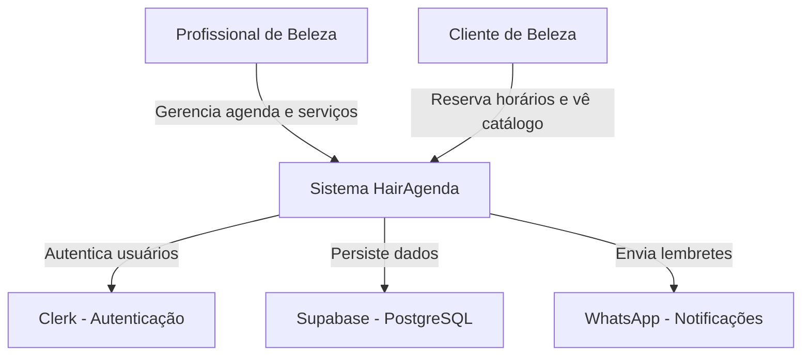
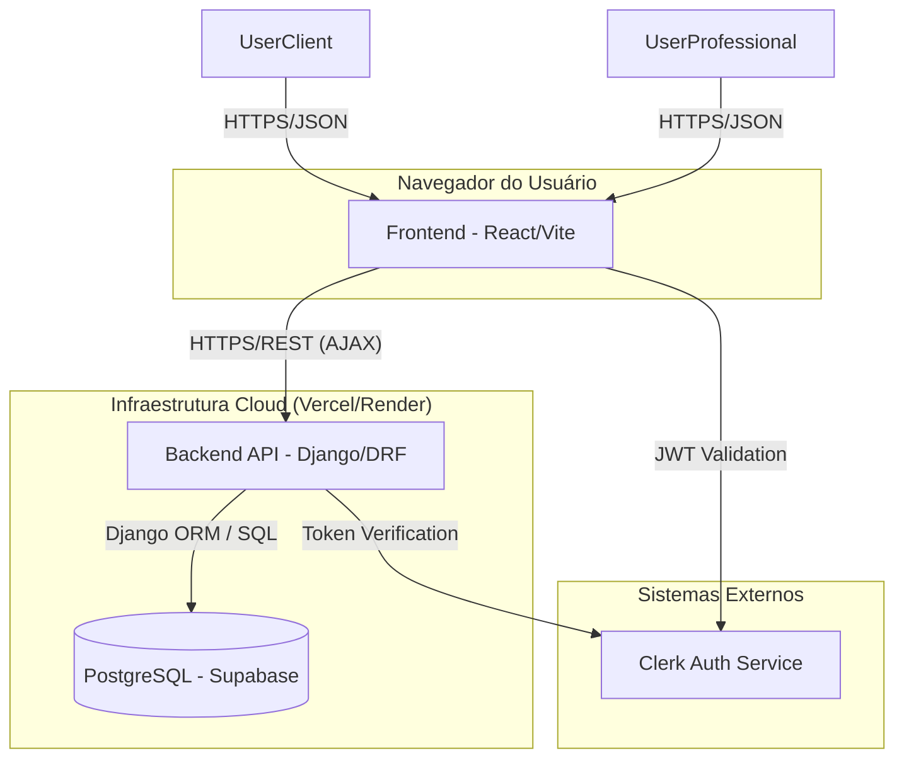

# C4 Model - HairAgenda

Este documento apresenta a arquitetura do sistema HairAgenda utilizando o modelo C4 (Contexto e Contêineres).

## Nível 1: Diagrama de Contexto de Sistema

Este diagrama descreve as interações de alto nível entre os usuários e o sistema HairAgenda com sistemas externos.

## Nível 2: Diagrama de Contêineres

Este diagrama detalha os contêineres internos do sistema, as tecnologias utilizadas e os fluxos de comunicação.

## Considerações sobre a Arquitetura

1.  **Segurança:** A autenticação é delegada ao Clerk, garantindo que o sistema não armazene senhas sensíveis diretamente.
2.  **Escalabilidade:** O frontend estático pode ser escalado globalmente pela Vercel, enquanto a API Django lida com a lógica de negócio central.
3.  **Confiabilidade:** O uso de PostgreSQL garante transações seguras para evitar agendamentos duplicados (Race Conditions).
