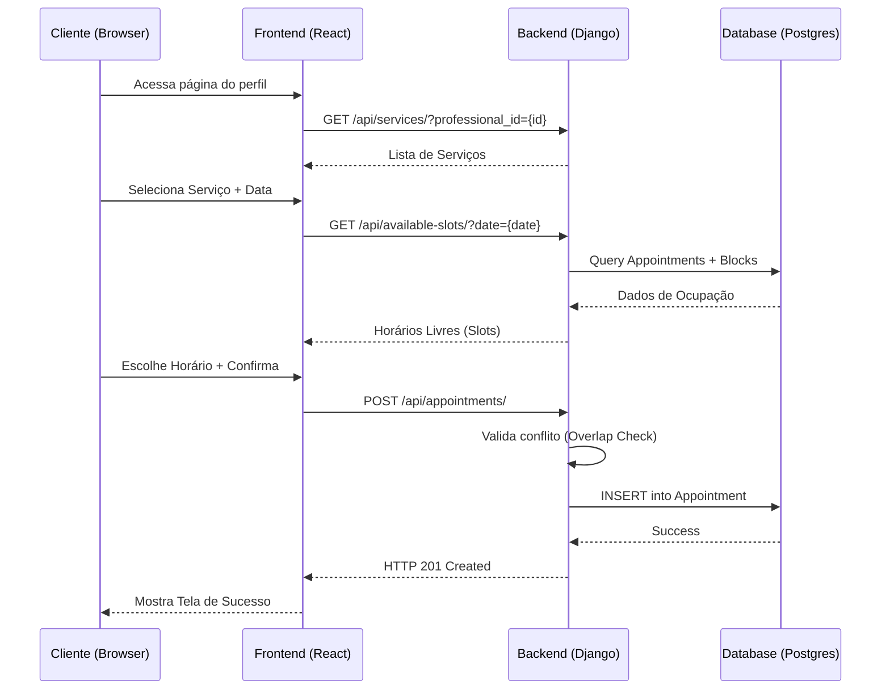
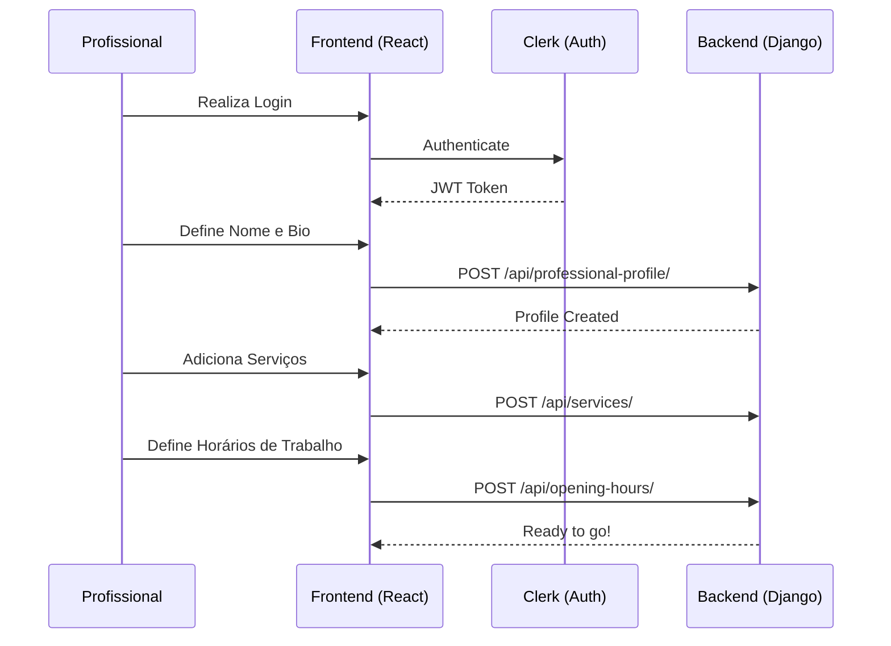
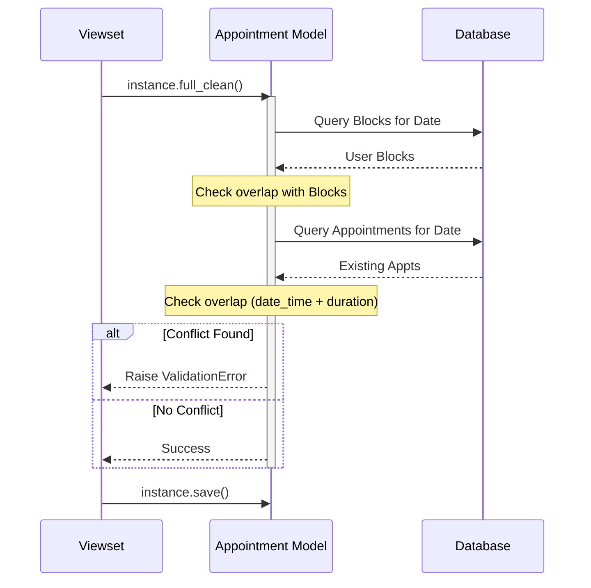

# Diagramas de Sequência (Sequence Diagrams)

Este documento detalha os fluxos de interação entre os componentes do sistema para os casos de uso críticos.

## 1. Fluxo de Agendamento (Visão Cliente)

Descreve o processo desde a escolha do serviço até a confirmação da reserva.

## 2. Configuração Inicial (Visão Profissional)

Processo de configuração do ambiente de trabalho do profissional.

## 3. Lógica de Prevenção de Conflito (Backend)

Detalhamento da validação interna de `clean()` no modelo Django.

